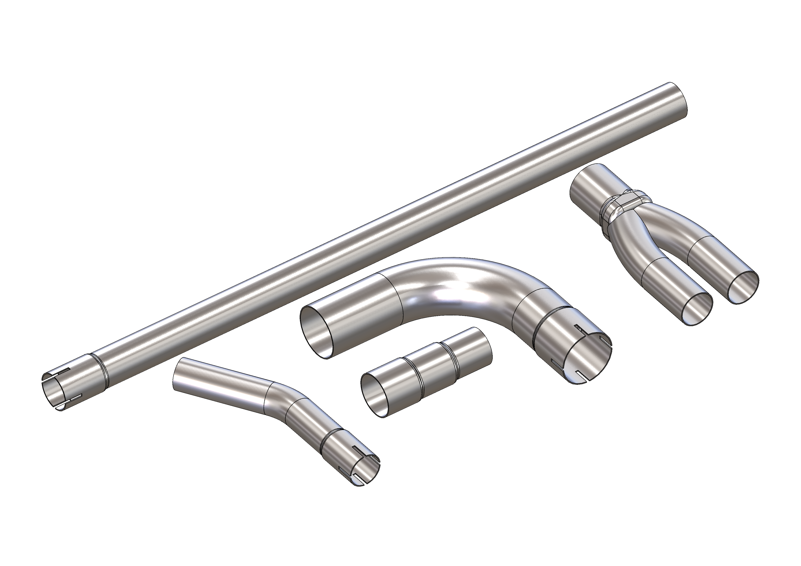

  

# Biltema Exhaust Parts - CAD Library
Unofficial CAD library. Not affiliated with or endorsed by Biltema.

Created to make it easier to design complete exhaust systems in CAD
before purchasing and fabricating the physical parts.

## File naming

Biltema article number - description.step

Example:
79-8546 - 76mm 90deg.step

## Accuracy

Models are based on measurements of physical components and/or
published Biltema dimensions.

These models are intended for layout and fabrication planning.
Always verify critical dimensions against the physical component.

## Disclaimer

This is an unofficial community project and is not affiliated with,
sponsored by, or endorsed by Biltema.
Biltema product names and article numbers are used for identification only.
